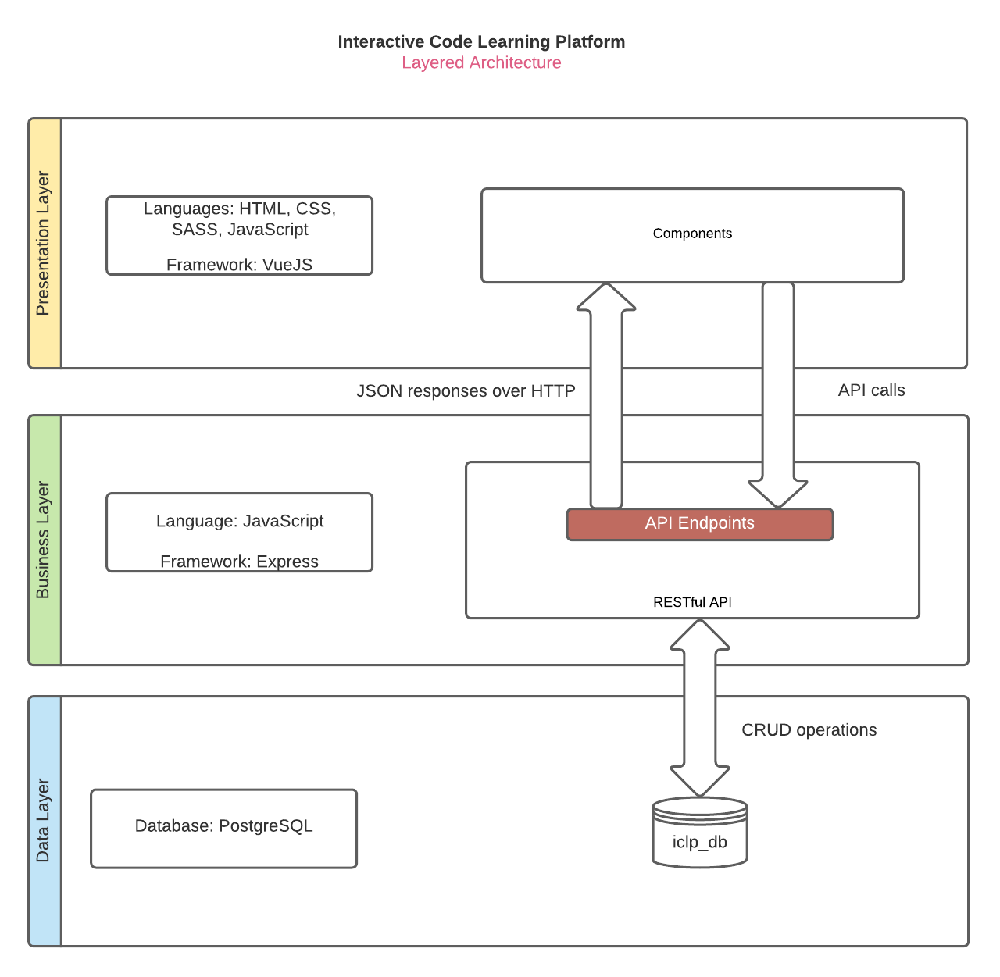

# Programming knowledge tester
**The project has been deployed [here](https://iclp-sms.netlify.app/).
This is our front-end repo. Backend repo is [here](https://github.com/mwashief/iclp-api).**

## Features
- MCQ challenges
- Coding challenges
- Dual challenges
- Automatic scoring
- User statistics & ranking
- Admins can add new challenges

## Technologies used

### Frontend
- Vue.js
- Vuex
- bootstrap-vue
- Sass
- Adobe XD (for UI design)

### Backend
- Node.js
- Express
- PostgreSQL
- Docker (for deployment, as we needed external dependency GCC to automatically evaluate users' programs)
- Passport.js cookie-session for authentication

## How to run
1. First, download and install  [Node](https://nodejs.org/en/) if it is not already installed. Make sure that node version is 14 (latest stable).
2. Install vue-cli package globally. Use this command-
``npm install -g @vue/cli``. Details are [here](https://cli.vuejs.org/guide/).
3. Clone this repo on your machine. 
4. Open terminal from the project's base directory.
5. Run ``npm install``. This will install all the required dependencies.
6. Now run dev server, using- `` npm run serve``. Alternatively, you can run `vue ui` and import this directory.
7. Check whether everything is working properly.


## Info
1. Vue 2.7.11  is used. They have very good [documentation](https://vuejs.org/v2/guide/).
2. We are using [bootstrap library](https://bootstrap-vue.org/docs).

### Project setup

```

npm install

```

  

### Compiles and hot-reloads for development

```

npm run serve

```

  

### Compile, minify for production & Deploy


If you wanna deploy to a site with address ...../REPO_NAME/ (e.g. shafinkhadem.github.io/iclp) instead of ..../ (e.g. iclp.netlify.app), you have to add `publicPath: process.env.NODE_ENV === "production" ? "/REPO_NAME/" : "/"` to module.exports of vue.config.js.

```

VUE_APP_SERVER_URL=<DEPLOYED_BACKEND_URL> npm run build && cp dist/index.html dist/404.html

```

without copying index.html to 404.html, direct links to vue routes wouldn't work. Deploy the created dist folder.

### Lints and fixes files

```

npm run lint

```

  

### Customize configuration

See [Configuration Reference](https://cli.vuejs.org/config/).

---
## Architecture used

